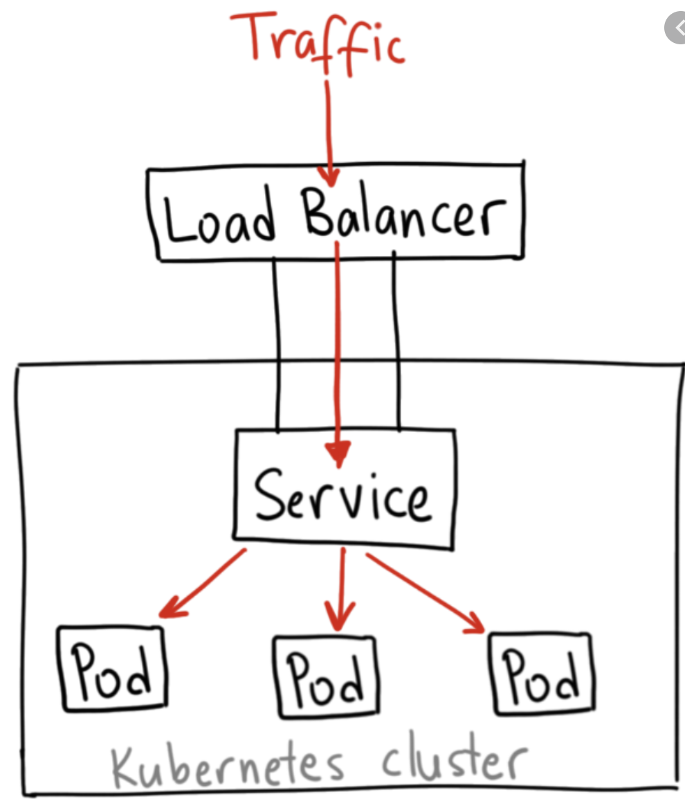

## Kubernetes (k8s) Nedir?

Kubernetes (**k8s**) açık kaynak olarak geliştirlen bir container orkestrasyon platformudur. Başlıca özelliklerinin arasında uygulamaların dağıtımı, ölçeklenmesi ve yönetilmesi bulunmaktadır. 

Kubernetes üzerinde obje oluşturmak, düzenlemek veya silmek için **kubectl** komut arayüzü kullanılabilir. Kubectl üzerinde gireceğiniz komutlar arka tarafta Kubernetes API 'lerine iletilerek işlemler gerçekleştirilir.

**Kubernetesi API** 'lerini kendi uygulamalarınız üzerinde de doğrudan kullanabilirsiniz.

## Pods
Kubernetes üzerinde çalışan her bir prosesi temsil etmektedir. Genel kabul görmüş kullanım şekli herbir pod üzerinde bir container çalıştırılmasıdır. Tabiki bunun istisna olduğu durumlar da mevcuttur.

Podları listele:
```
kubectl get pods
```
Podları ayrıntılı bilgiler içerecek şekilde listele:
```
kubectl get pods -o wide
```
Belli bir node üzerinde çalışan tüm pods listesi:

```
kubectl get pods --field-selector=spec.nodeName=[server-name]
```
## Replica Set
Kubernetes üzerinde tanımlanan bir yaml file ile belirtilen sayı kadar pod kopyası ayağa kaldırdır. Ölen podların yerine yenisini koyar. 

Replica Set'leri listeleme:

```shell
kubectl get rs
```
Replica set 'in ayrıntılı bir şekilde durumunu kontrol etmek:

```shell
kubectl describe rs/frontend
```

İlgili yaml Replica Seti k8s üzerinde uygulamak için.

```shell
kubectl apply -f https://kubernetes.io/examples/pods/pod-rs.yaml
```

Örnek bir replica set yaml:

```yaml
apiVersion: apps/v1
kind: ReplicaSet
metadata:
  name: frontend
  labels:
    app: guestbook
    tier: frontend
spec:
  replicas: 3
  selector:
    matchLabels:
      tier: frontend
  template:
    metadata:
      labels:
        tier: frontend
    spec:
      containers:
      - name: php-redis
        image: gcr.io/google_samples/gb-frontend:v3
```
## Minikube
Minikube windows, linux veya MacOS üzerinde kurup kullanabileceğiniz mini bir kubernetes cluster yapısı sağlar. Ayrıca kubernetes bileşenlerini yönetebileceğiniz bir dashboard sağlar.

Start
```
minikube start
```
## Service

Podlar arasındaki iletişimi sağlayan aynı zamanda podların dışarıdan erişimine imkan veren bir bileşendir. Podlara service aracılığı ile cluster içinden veya load balancer aracılığı ile dışardan da erişim mümkündür. Podlar arasındaki trafiği yönetir.



**Nasıl yapar?**
"selector" kısmında tanımlayacağımız label ile bu label bilgilerine sahip podları eşleyerek. Üzerine gelen istekleri ilgili podlara dağıtır. 

Örnek:
```
apiVersion: v1                             
kind: Service
metadata:
  name: service-metadata-1
spec:
  type: NodePort                              
  selector:
    app: demo-label
  ports:
  - name: http
    protocol: TCP
    port: 80                                 
    targetPort: 80                           
```

## Deployment
Deployment replica setleri yönettiğimiz bir kubernetes objesidir. Birden fazla replica seti tanımlayabildiğimiz için bize rolling update imkanı sunar. Örnek verecek olursak 5 tane eski versiyon (v1) podumuzun yerine v2 versiyonları deploy edeceğimiz zaman tüm podları öldürerek downtime yaratmamış olur. Bunun yerine aşamalı olarak öldürdüğü pod kadar v2 versiyon deploy ederek downtime 'ın önüne geçer.

Örnek bir deployment:
```
apiVersion: apps/v1
kind: Deployment
metadata:
  name: nginx-deployment
  labels:
    app: nginx
spec:
  replicas: 3
  selector:
    matchLabels:
      app: nginx
  template:
    metadata:
      labels:
        app: nginx
    spec:
      containers:
      - name: nginx
        image: nginx:1.14.2
        ports:
        - containerPort: 80
```